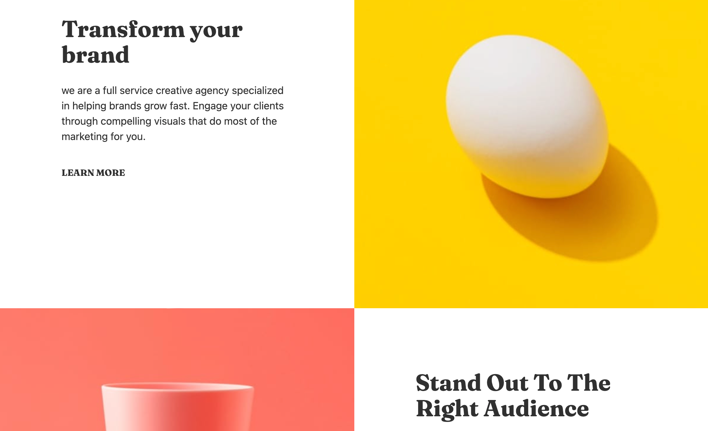
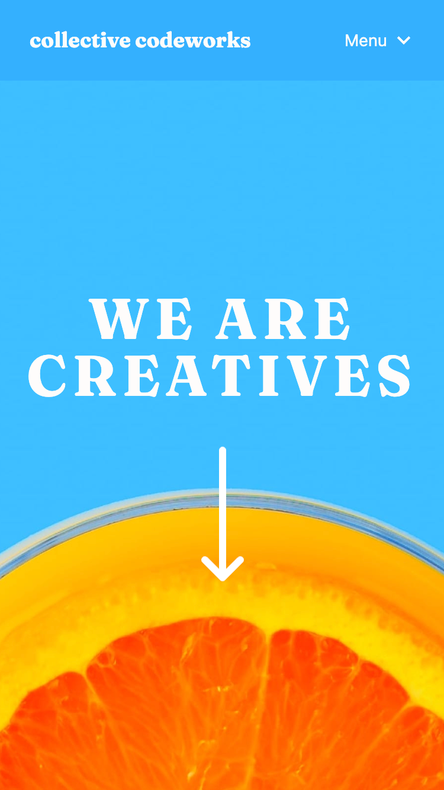

# Collective Codeworks

## Description

This template was created for a client who is starting a design consultancy. Because many of their customers come from Instagram or other apps, it was important to take a mobile-first approach, while also providing an elegant desktop view.
Their customer base also consists of users who speak languages other than English. By using react-i18next, localization can easily be provided and changed dynamically.

## Screenshots

## Technologies Used

Vite + React, Tailwind, DaisyUI, react-i18next

## Live Site Preview

https://jsnicholas.github.io/collective-codeworks/
